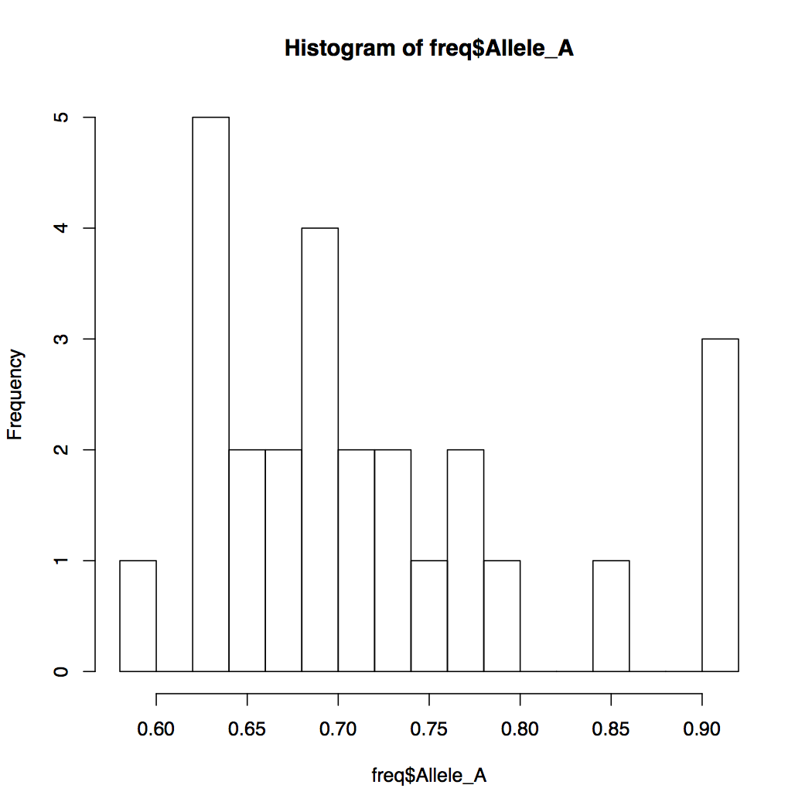
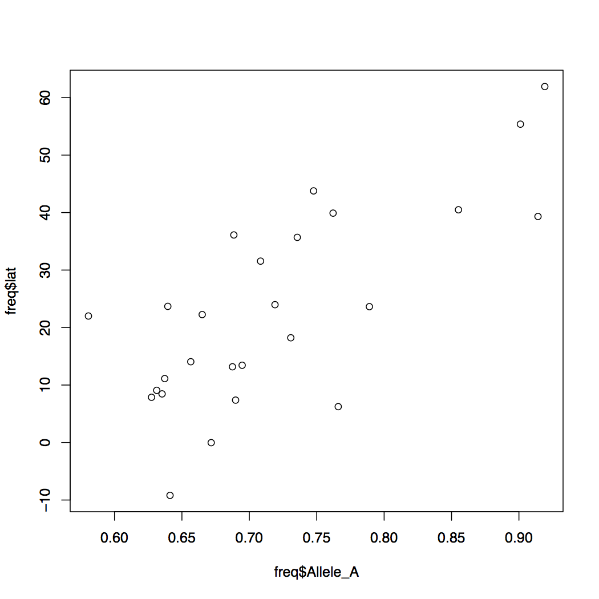
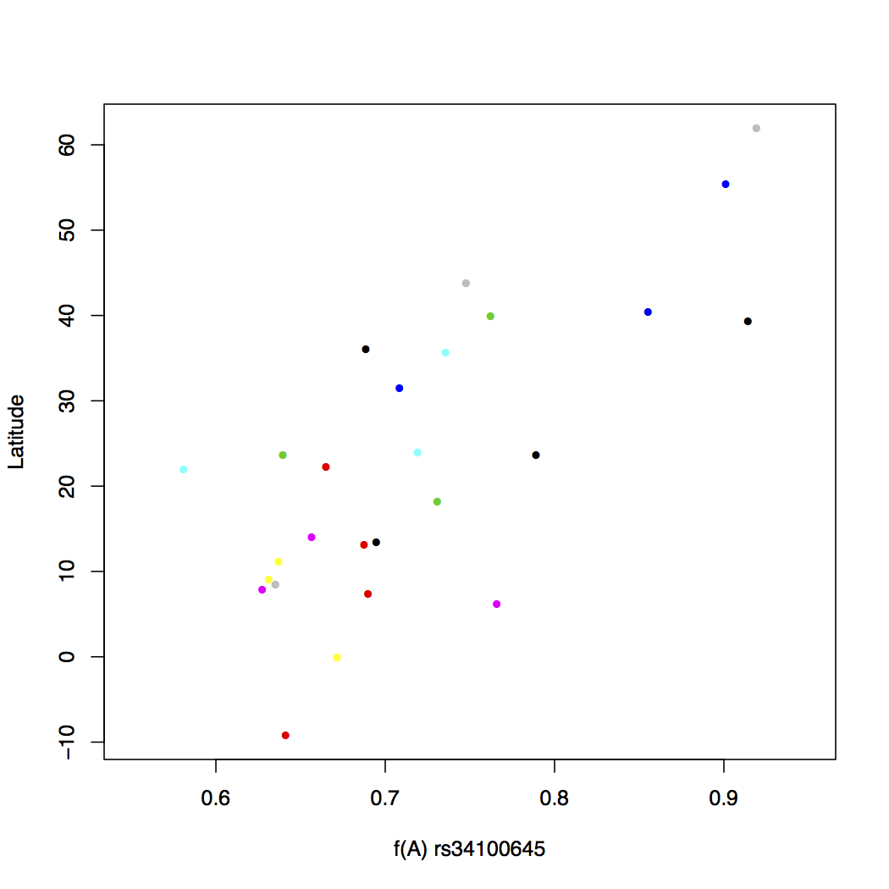
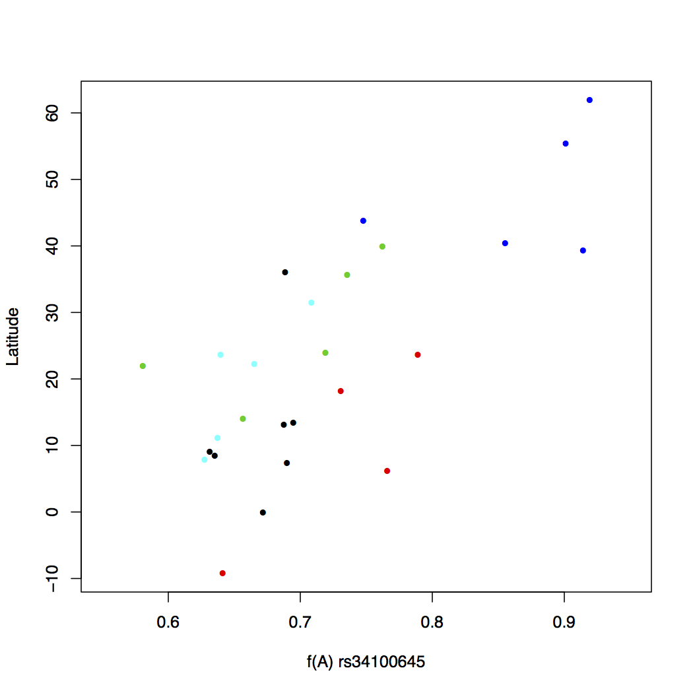
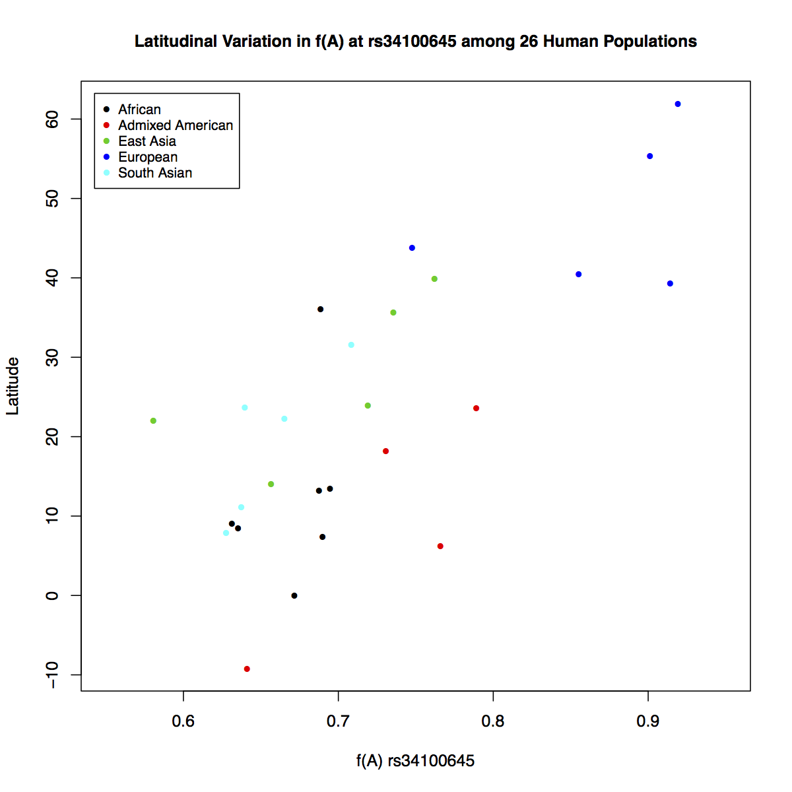
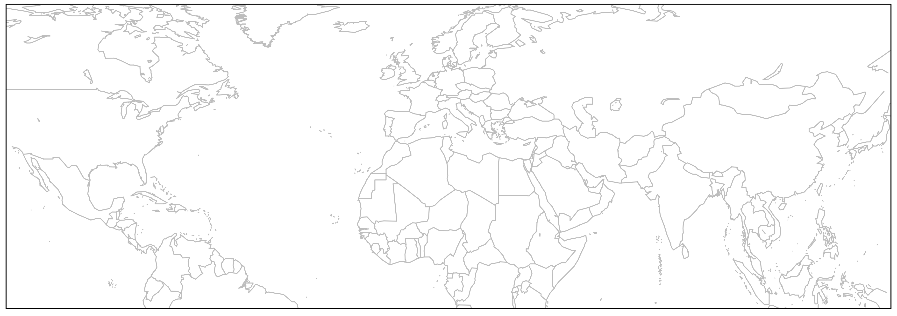
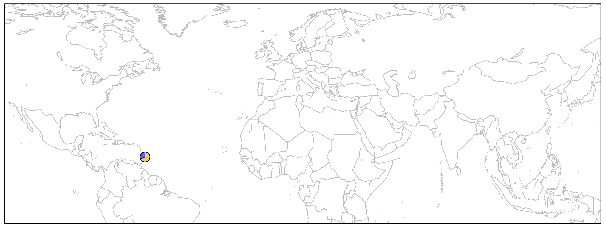
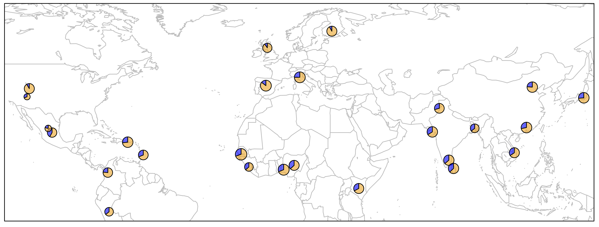
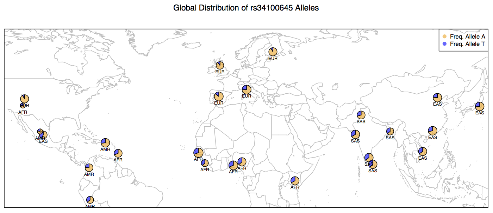

# Human Population Genomic Variation 
## Variants (SNPs) in *LCT* Gene: Part 2
### Molb 4485/5485 -- Computers in Biology ##

### Vikram Chhatre and Nicolas Blouin ####
Wyoming INBRE Bioinformatics Core  
Dept. of Molecular Biology  
University of Wyoming  

[vchhatre@uwyo.edu](mailto:vchhatre@uwyo.edu)   
[nblouin@uwyo.edu](mailto:nblouin@uwyo.edu)  
[http://molb4485.uwyo.online](http://molb4485.uwyo.online)  
<hr> 


</a>
Hunting and Gathering to Pastoralism. Image Credit: [Dan Burr](http://dburr.blogspot.com) 


<h3 style="color: red;"> Important: </h3> 

**1. Do not race ahead in the tutorial.**  

**2. Doing so compromises your learning experience.** 

**3. You may not leave early today!**
<br><br><br>

## Table of Contents
4. [The R Programming Language](#r)
5. [Plotting Data on Geographical Maps](#maps)
6. [Save Your Work](#save)


<br><br><br><br><br>


<a name="r"></a>

## 4. The ``R`` Programming Language

[R](http://www.r-project.org) has become the *de-facto* standard in the scientific community for statistical data analysis and visualization.  It is a completely open source language.  R comes with a basic framework of functions and utilities commonly used for these two purposes.  For anything specialized, you will need to load additional packages into the memory.  This is very similar to the module loading system on MtMoran that you have been interacting with lately.


### 4.1 Launch an ``R`` Session

R can run both within the terminal shell or as a standalone GUI application (e.g. R-Studio). For today's exercise, we will run R in the ``Terminal.app``. Launch a new R session as follows:


```bash

$ r


```

Note that your version may be different.

```r

R version 3.3.1 (2016-06-21) -- "Bug in Your Hair"
Copyright (C) 2016 The R Foundation for Statistical Computing
Platform: x86_64-apple-darwin13.4.0 (64-bit)

R is free software and comes with ABSOLUTELY NO WARRANTY.
You are welcome to redistribute it under certain conditions.
Type 'license()' or 'licence()' for distribution details.

  Natural language support but running in an English locale

R is a collaborative project with many contributors.
Type 'contributors()' for more information and
'citation()' on how to cite R or R packages in publications.

Type 'demo()' for some demos, 'help()' for on-line help, or
'help.start()' for an HTML browser interface to help.
Type 'q()' to quit R.

>

```

Notice that the R prompt is ``>`` as opposed to Linux where the prompt is ``$``.


### 4.2 Import Data into ``R``


R has specific functions for reading text files as data frames. It can import a variety of text files (comma or tab separated). We will now import the gene frequency data that we created earlier (``freq.df``). Note that our data is in tab delimited format.


```r

> getwd()

[1] "/Users/vikram/LASTNAME_Week5"

> options(width=150)

> freq <- read.table('freq.df', header=T)

> head(freq)

  pop  dist superpop     lat      long                  popname CHROM       POS N_ALLELES N_CHR Allele_A  Allele_T
1 ACB 13.19      AFR 13.1776  -59.5412       African_Carib_BBDS     2 135805941         2   192 0.687500 0.3125000
2 ASW -8.78      AFR 36.1070 -112.1130  African_Ancestry_SW_USA     2 135805941         2   122 0.688525 0.3114750
3 BEB 23.68      SAS 23.6850   90.3563    Bengali_in_Bangladesh     2 135805941         2   172 0.639535 0.3604650
4 CDX 22.01      EAS 22.0088 -100.7971              Chinese_Dai     2 135805941         2   186 0.580645 0.4193550
5 CEU 62.28      EUR 39.3210 -111.0937 Utah_Resid_from_NWEurope     2 135805941         2   198 0.914141 0.0858586
6 CHB 23.13      EAS 39.9042  116.4074              Han_Chinese     2 135805941         2   206 0.762136 0.2378640


> tail(freq)

  pop  dist superpop     lat     long               popname CHROM       POS N_ALLELES N_CHR Allele_A Allele_T
21 PEL -9.19      AMR -9.1900 -75.0152              Peruvian     2 135805941         2   170 0.641176 0.358824
22 PJL 31.55      SAS 31.5546  74.3572        Punjabi_Lahore     2 135805941         2   192 0.708333 0.291667
23 PUR 18.22      AMR 18.2208 -66.5901          Puerto_Rican     2 135805941         2   208 0.730769 0.269231
24 STU  7.87      SAS  7.8731  80.7718      Sri_Lankan_Tamil     2 135805941         2   204 0.627451 0.372549
25 TSI 43.77      EUR 43.7711  11.2486         Toscani_Italy     2 135805941         2   214 0.747664 0.252336
26 YRI 10.16      AFR  7.3775   3.9470 Yoruba_Ibadan_Nigeria     2 135805941         2   216 0.689815 0.310185

```

Notice that R formats the data so that's all columns are properly spaced making it easy to read. First checked our current location in the directory tree. Then we set the display width to 150 characters. Finally we imported our data and stored it into the variable freq. Now try the following functions:


```r

> names(freq)
 [1] "pop"       "dist"      "superpop"  "lat"       "long"      "popname"   "CHROM"     "POS"       "N_ALLELES" "N_CHR"     "Allele_A"  "Allele_T" 

> dim(freq)
[1] 26 12


```


The above two commands tell you the names of columns and the dimensions of the data frame. Do the dimensions match your expectations? This can be a sanity check for the files you read in. If something is off, you will be able to notice it here.


### 4.3 Accessing Rows and Columnss

R keeps track of the order of each row and column in data frame by assigning them serial numbers. Thus you can access specific rows and columns of the data frames very quickly and easily. See the following example:


```r

> freq[1:5,]

  pop  dist superpop     lat      long                  popname CHROM       POS N_ALLELES N_CHR Allele_A  Allele_T
1 ACB 13.19      AFR 13.1776  -59.5412       African_Carib_BBDS     2 135805941         2   192 0.687500 0.3125000
2 ASW -8.78      AFR 36.1070 -112.1130  African_Ancestry_SW_USA     2 135805941         2   122 0.688525 0.3114750
3 BEB 23.68      SAS 23.6850   90.3563    Bengali_in_Bangladesh     2 135805941         2   172 0.639535 0.3604650
4 CDX 22.01      EAS 22.0088 -100.7971              Chinese_Dai     2 135805941         2   186 0.580645 0.4193550
5 CEU 62.28      EUR 39.3210 -111.0937 Utah_Resid_from_NWEurope     2 135805941         2   198 0.914141 0.0858586


```

```r

> freq[,1:5]

   pop  dist superpop     lat      long
1  ACB 13.19      AFR 13.1776  -59.5412
2  ASW -8.78      AFR 36.1070 -112.1130
3  BEB 23.68      SAS 23.6850   90.3563
4  CDX 22.01      EAS 22.0088 -100.7971
5  CEU 62.28      EUR 39.3210 -111.0937
6  CHB 23.13      EAS 39.9042  116.4074
7  CHS 24.48      EAS 23.9790  113.7633


```


```r

> freq[1:5,1:5]

  pop  dist superpop     lat      long
1 ACB 13.19      AFR 13.1776  -59.5412
2 ASW -8.78      AFR 36.1070 -112.1130
3 BEB 23.68      SAS 23.6850   90.3563
4 CDX 22.01      EAS 22.0088 -100.7971
5 CEU 62.28      EUR 39.3210 -111.0937


```

As these examples show, you can access specific columns and rows in a data frame. In the first example, we asked R to print rows 1 through 5 to the screen. We indicated rows by printing a comma at the end of our argument. Likewise, columns can be specified by prefixing a comma to the argument. In the last example, we limited the output to the first 5 rows and 5 columns by providing both arguments separated by a comma. **Try out more examples on your own**.


### 4.4 Getting Summary Statistics

Suppose you want to calculate basic summary statistics on columns with numerical data. In our data frame, we have three numerical columns: (1) Population location latitudes, (2) Frequency of Allele A and (3) Frequency of Allele T. Let's work on these columns. While doing so, let's learn another way to access columns in R, by using their names.


```r

> range(freq$lat)

[1] -9.1900 61.9241


> summary(freq$Allele_A)

   Min. 1st Qu.  Median    Mean 3rd Qu.    Max. 
 0.5806  0.6450  0.6923  0.7190  0.7585  0.9192 


> summary(freq$N_CHR)

   Min. 1st Qu.  Median    Mean 3rd Qu.    Max. 
  122.0   186.5   198.0   192.6   207.5   226.0 


```

We tested two R functions above. First function range shows the upper and lower limits of the data. In other words, it reports the minimum and maximum values. Thus, by looking at the output you can tell that our data comes from human populations that range 70 degrees in latitudinal distribution.

Second function, ``summary()`` shows basic statistics for the data - in this case, frequency of allele A. It shows mean, median, and the quantile distribution of the values. Notice that frequency of the allele varies a lot. It goes from 0.58 all the way to 0.92.

As you can see these simple functions are quite handy to get some basic information about data set of any size.


### 4.5 Histograms

There is another method in R to quickly gain understanding of how your data is distributed.

```r

> hist(freq$Allele_A)


```

</img>


By default, R breaks into your data into appropriate number of bins. You can change this default behavior by specifying the number of bins.  Notice how the Y-axis limits change when you do that.

```r

> hist(freq$Allele_A, breaks=20)


```

</img>


### 4.6 Scatterplots

When you want to compare the relationships of two variables with each other, a scatterplot comes handy. How would you make a scatterplot in R? Below are a series of R commands each building up the plot we desire, bit by bit. Type each command in increments and observe the resulting plot before typing the next command.


```r

plot(freq$Allele_A, freq$lat)


```

</img>


You can modify the default behavior of the R graphics by specifying more options.  Try the examples below.


```r

> plot(freq$Allele_A, freq$lat, xlab="f(A) rs34100645", ylab="Latitude", pch=16)


```


```r

> plot(freq$Allele_A, freq$lat, xlab="f(A) rs34100645", 
		ylab="Latitude", pch=16, cex=0.8, 
		col=freq$popname, xlim=c(0,1))

```

Much better aeshetics?  Note that the points are all clumped together because we increased the default x-axis range to be 0 through 1.  But really our data only spans about 0.55 to 0.92.  So let's change that around.


```r

> plot(freq$Allele_A, freq$lat, xlab="f(A) rs34100645", 
		ylab="Latitude", pch=16, cex=0.8, 
		col=freq$popname, xlim=c(0.55,0.95))

```

</img>


Assigning a different color to each of the 26 populations makes things messy.  There is no real pattern obvious here.  But what happens if you instead assign colors by super population? Recall that the regional subpopulations are grouped into 5 global superpopulations.  


```r

> plot(freq$Allele_A, freq$lat, xlab="f(A) rs34100645", 
		ylab="Latitude", pch=16, cex=0.8, 
		col=freq$superpop, xlim=c(0.55,0.95))

```

</img>


This looks a lot better.  Now some pattern is evident in the change of allele frequency across super populations.  But we still do not know which color goes with what population, though you can probably figure the continent out by looking at the latitude.  One way to make this connection is to write a legend within the plot itself.  This is easy to do in R.  We will also add a main title for the plot. 


```r

> plot(freq$Allele_A, freq$lat, xlab="f(A) rs34100645", 
		ylab="Latitude", pch=16, cex=0.8, 
		col=freq$superpop, xlim=c(0.55,0.95))

> legend('topleft', c('African', 'Admixed American', 'East Asia', 'European',
     		'South Asian'), cex=0.8, col=c(1:5), pch=16, inset=0.02)

> title(main="Latitudinal Variation in f(A) at rs34100645 
		among 26 Human Populations", cex.main=1)


```

</img>

It is much clear based on this plot that the frequency of allele A increases going from southern to northern latitudes.  It makes us wonder what relationship might exist between the longitudinal positions of populations and the frequency of this allele.  But how would you reconcile both geographical coordinates and the frequency data together in one plot?  Plotting directly on maps will allow you to do that.


<a name="maps"></a>

## 5. Plotting Data on Geographical Maps

Before we can begin, we will need access to the following libraries.  Try to load all of these *one by one*.  Chances are some of them are not available on your workstation; in which case you will need to install them.


### 5.1 Load/Install Packages

```r

> library(maps)

> library(mapdata)

> library(scales)

> library(mapplots)

Error in library(mapplots) : there is no package called ‘mapplots’


install.packages('maps')
install.packages('mapdata')
install.packages('scales')
install.packages('mapplots')

> library(mapplots)
```


### 5.2 Draw World Map Layer

Below, you will be typing the same commands over and over again.  It's best to start a script and write things in there.  Open a new tab in your terminal using ``Cmd``+``t``.  Note that the new terminal tab starts with a linux prompt, not R prompt.  Do not be confused between the two.

```bash

$ touch plots.R


```

Then open the file in GUI version of the vim text editor.


 </img>


```r

> map('worldHires', xlim=c(-120,142), ylim=c(-12,72), col='gray', fill=FALSE)


```

 </img>


#### 5.3 Plot Human Populations

We will plot the 26 human populations on this map using the geographical coordinates available to us.

```r

> map('worldHires', xlim=c(-120,142), ylim=c(-12,72), col='gray', fill=FALSE)

> points(freq$long, freq$lat, pch=16, col="salmon")

> box()


```

</img>


#### 5.4 Adjust Point Size 

We could make this plot more informative if we linked the point size to allele frequency.


```r

> map('worldHires', xlim=c(-120,142), ylim=c(-12,72), col='gray', fill=FALSE)

> points(freq$long, freq$lat, pch=16, cex=freq$Allele_A*1.5, col="salmon")

> box()


```

</img>


#### 5.5 Using Pie Charts to Display Relative Allele Frequencies

This would perhaps be the best way to depict our data on the map, because it will show relative frequencies of both alleles at every given geographical position (i.e. population).


First, let's just draw one pie to see how it works.  We can then apply the same principal to the remaining points on the map.


```r

> map('worldHires', xlim=c(-120,142), ylim=c(-12,72), col='gray', fill=FALSE)

> add.pie(z=c(0.68, 0.32), x=-59.5412, y=13.1776, radius=192/100, 
			col=c(alpha("orange", 0.6), alpha("blue", 0.6)), labels="")

> box()


```

As you can see below, we just plotted the allele frequency data for the Barbados African population using a pie chart.  The orange and blue colors are representative of the frequencies of alleles A and T respectively.

</img>


#### 5.6 Plot All Pie Charts Using ``for{}`` Loop


In order to plot one pie chart per population of data, what we need to do essentially is to cycle through the code above for each row of our data frame ``freq.df``.  If you need a refresher in what was contained in that data frame, run a head on it quickly:


```bash

> head(freq)

  pop  dist superpop     lat      long                  popname CHROM       POS N_ALLELES N_CHR Allele_A  Allele_T
1 ACB 13.19      AFR 13.1776  -59.5412       African_Carib_BBDS     2 135805941         2   192 0.687500 0.3125000
2 ASW -8.78      AFR 36.1070 -112.1130  African_Ancestry_SW_USA     2 135805941         2   122 0.688525 0.3114750
3 BEB 23.68      SAS 23.6850   90.3563    Bengali_in_Bangladesh     2 135805941         2   172 0.639535 0.3604650
4 CDX 22.01      EAS 22.0088 -100.7971              Chinese_Dai     2 135805941         2   186 0.580645 0.4193550
5 CEU 62.28      EUR 39.3210 -111.0937 Utah_Resid_from_NWEurope     2 135805941         2   198 0.914141 0.0858586
6 CHB 23.13      EAS 39.9042  116.4074              Han_Chinese     2 135805941         2   206 0.762136 0.2378640

```


``for{}`` loops in R are notoriously slow for large data sets, but we have just got 26 iterations of the loop, so we do not need to worry about computational speed.  Loops in R are similar to those in bash or any other language and they take the following general form:


```r
for (i in 1:100){
  do something
}

```

This means run ``something`` command 100 times.  How can we apply this to our data?


```r

> map('worldHires', xlim=c(-120,142), ylim=c(-12,72), col='gray', fill=FALSE)


> for (i in 1:26){
  add.pie(z=c(freq$Allele_A[i], freq$Allele_T[i]), x=freq$long[i], y=freq$lat[i], 
		radius=freq$N_CHR[i]/100, col=c(alpha("orange", 0.6), alpha("blue", 0.6)), labels="")
  i=i+1
}

> box()


```


</img>

There are several important bits of information depicted in this plot.

1. Geographical positions of populations
2. Size of the population under study (Pie circle size)
3. The relative frequencies of the two alleles


All we need to do now is to add a legend and then the plot is ready.


#### 5.7 Add Legend and Label Populations


```r

> map('worldHires', xlim=c(-120,142), ylim=c(-12,72), col='gray', fill=FALSE)


> for (i in 1:26){
  add.pie(z=c(freq$Allele_A[i], freq$Allele_T[i]), x=freq$long[i], y=freq$lat[i], 
		radius=freq$N_CHR[i]/100, col=c(alpha("orange", 0.6), alpha("blue", 0.6)), labels="")
  i=i+1
}

> text(freq$long, freq$lat, labels=freq$superpop, cex=0.5, pos=1)

> box()

> legend('topright', bty='1', c("Freq. Allele A", "Freq. Allele T"), 
		pch=16, col=c(alpha("orange", 0.6), alpha("blue", 0.6)), pt.cex=1, cex=0.7)

> title(main="Global Distribution of rs34100645 Alleles", font.main=1, cex.main=0.9)


```


</img>


#### 5.8 Save the Map Plot 

Below are the contents of your script ``plots.R``.  Do not include the ``>`` prompts in the script.  Once you are done writing the entire script. You can run it without copy pasting (see below).


```r

pdf('WorldPie_Final2.pdf', width=10, height=7)

map('worldHires', xlim=c(-120,142), ylim=c(-12,72), col='gray', fill=FALSE)


for (i in 1:26){
  add.pie(z=c(freq$Allele_A[i], freq$Allele_T[i]), x=freq$long[i], y=freq$lat[i], 
		radius=freq$N_CHR[i]/100, col=c(alpha("orange", 0.6), alpha("blue", 0.6)), labels="")
  i=i+1
}

text(freq$long, freq$lat, labels=freq$superpop, cex=0.5, pos=1)

box()

legend('topright', bty='1', c("Freq. Allele A", "Freq. Allele T"), pch=16, 
		col=c(alpha("orange", 0.6), alpha("blue", 0.6)), pt.cex=1, cex=0.7)

title(main="Global Distribution of rs34100645 Alleles", font.main=1, cex.main=0.9)

dev.off()

```

Execute the script as follows.  You don't have to close vim in order to run the script.  Just make to sure to save all the changes.

```r

> source("plots.R")

```


#### 5.9 Closing Analysis

Based on this map, what inferences can you make about the distribution of Allele A at locus rs34100645 on Chromosome # 2 in human populations across the globe?  This is one of the more than 1000 SNPs, including those within the *LCT* gene and a few upstream of the gene itself that are implicated in the ability to digest lactose sugar present in the milk.  

In pre-historic times, humans were primarily hunter gatherers and thus had no exposure to dairy milk or its many products.  When the hunter gatherers started settling down and pastoral practices emerged, humans were first exposed to lactose in dairy milk.  As it turns out, some populations have evolved the ability to regulate the *LCT* gene products in alternative ways in order to be able to digest the Lactose more efficiently whereas others did not.


Our analysis shows only a partial picture of the entire Lactose Persistence ability in humans.  There are many pieces to this puzzle, which has been recently solved.  For an excellent review of what we know about *Lactose Persistence* in humans, see the following publication:


[Ségurel, Laure, and Céline Bon. *On the Evolution of Lactase Persistence in Humans*](http://www.annualreviews.org/doi/abs/10.1146/annurev-genom-091416-035340)


<br><br>


<a name="save"></a>

## 6. Saving Your Work


### 6.1 On Local Workstation

1. Save your RSession in an image.  Make sure to replace LASTNAME with your own.

```r

> setwd("~/LASTNAME_Week5/")

> save.image('LASTNAME_Week5.RData')

```

2. Compress all files you generated today and copy them to the Week5 folder on MtMoran.

```bash

$ cd ~/LASTNAME_Week5/

$ tar -cvzf LASTNAME_Week5_Local.tar.gz *

$ scp LASTNAME_Week5_Local.tar.gz [inbreNNN]@mtmoran.uwyo.edu:/project/inbre-train/[inbreNNN]/Week5/


```


### 6.2 On MtMoran

```bash

$ cd /project/inbre-train/[inbreNNN]/Week5/

$ history > LASTNAME_Week5_History.sh


``` 


